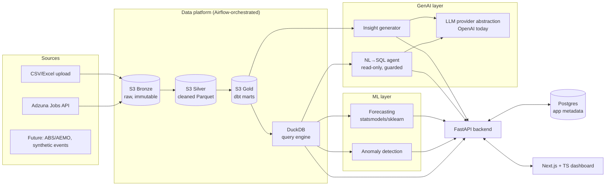

# Architecture — DataLens

## 1. High-level system

## 2. Layer responsibilities

### Lakehouse (medallion on S3)
- **Bronze**: raw payloads exactly as received (JSON from Adzuna, original uploaded files). Immutable; enables replay.
- **Silver**: typed, deduplicated, validated Parquet. Schema enforced with Pydantic/pandera.
- **Gold**: dbt-built marts (e.g. `fct_job_postings`, `dim_skills`, `skill_demand_daily`; per-uploaded-dataset cleaned tables).
- **Query engine**: DuckDB reading Parquet on S3 directly — warehouse-grade SQL without warehouse cost. dbt runs with `dbt-duckdb`.

### Orchestration — Airflow
- Runs in Docker Compose (LocalExecutor) on the EC2 host.
- DAGs: `adzuna_ingest_daily` (extract → bronze → silver → dbt → ML refresh), `csv_process` (event-triggered per upload via API → Airflow REST), `data_quality_checks`.
- Docs include the managed-AWS path (MWAA) as a scaling note — not used due to cost.

### Backend — FastAPI (Python 3.12)
- REST API: datasets, profiling, charts data, forecasts, chat.
- Async SQLAlchemy + Postgres for app metadata (users, datasets, runs, chat history).
- Server-Sent Events for streaming chat responses.
- Clean architecture: routers → services → repositories; connector plugin interface (`BaseConnector`: `discover() / extract() / schema()`).

### ML layer
- Forecasting: statsmodels (ETS/SARIMA) baseline, sklearn gradient boosting variant; auto-selected by backtest MAPE.
- Anomaly detection: STL residual + IQR/IsolationForest on numeric series.
- Results materialised to gold tables; recomputed by the DAG, served instantly by the API.

### GenAI layer
- **Provider abstraction**: thin internal interface (`LLMClient.complete/stream`) — OpenAI implementation now; any provider later.
- **Insight generator**: prompt assembled from dataset profile + gold-layer aggregates → structured JSON insights (headline, evidence, severity), rendered as cards.
- **Chat-with-data**: NL→SQL over DuckDB. Guardrails: read-only connection, single-statement SELECT-only validation (sqlglot parse), schema allowlist in prompt, LIMIT injection, result summarisation by LLM.
- **Eval seed**: small golden-question set per dataset checked in CI (post-MVP expansion).

### Frontend — Next.js 15 + TypeScript
- App Router, Tailwind, shadcn/ui, Recharts.
- Pages: Datasets (upload/connect), Dataset detail (profile + charts + insight cards + chat panel), Job Market Trends (curated), About (architecture story for recruiters).
- Deployed on Vercel free tier (keeps AWS budget for the data plane).

## 3. AWS deployment (~$20/month)

| Component | Service | Cost |
|---|---|---|
| Backend + Airflow + Postgres | 1× EC2 t3.small, Docker Compose | ~$15 |
| Lakehouse storage | S3 (few GB) | <$1 |
| Frontend | Vercel free tier | $0 |
| DNS/TLS | Route53 + Caddy/ALB-less (Caddy on instance) | ~$1 |
| LLM | OpenAI (existing credits) | $0 cash |
| Guard | AWS Budget alarm at $25 | — |

- **IaC**: Terraform for VPC-lite, EC2, S3, IAM, budget alarm.
- **CI/CD**: GitHub Actions — lint, typecheck, tests, dbt build, Docker build → push to GHCR → SSH deploy step; Vercel auto-deploys frontend.

## 4. ADRs (to be written as docs/adr/NNN-*.md as built)

1. DuckDB-on-S3 over Redshift/Snowflake — warehouse semantics at hobby cost; trivially swappable since dbt models are ANSI-ish SQL.
2. Airflow over Dagster/Prefect — AU job-ad keyword dominance.
3. Single EC2 + Docker Compose over ECS/EKS — cost; ECS migration path documented.
4. OpenAI behind internal abstraction — existing credits; no provider lock-in.
5. Vercel for frontend — free, fast, lets AWS budget go to the data plane.
6. Adzuna over scraping Seek/LinkedIn — legal, stable, documented API.
